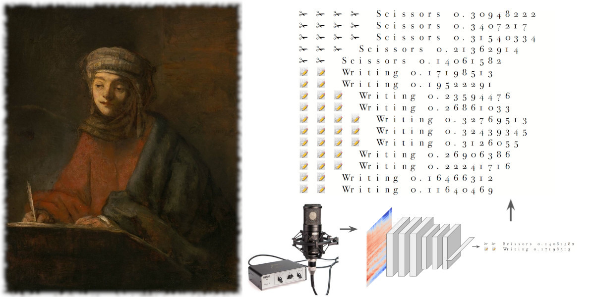

# Machine Learning Sound Classifier for Live Audio


(Picture on the left: [Rembrandt - Portrait of an Evangelist Writing, cited from Wikipedia](https://commons.wikimedia.org/wiki/File:Rembrandt_-_Portrait_of_an_Evangelist_Writing.jpg))

This is a simple, fast, for live audio in realtime, customizable machine learning sound classifier.

- MobileNetV2, light weight deep learning model, is trained by default.
- Tensorflow graph for runtime fast prediction, and for portability.
- Freesound Dataset Kaggle 2018 pre-built model is ready.
- Ensembling sequence of predictions (moving average) for stable results.
- Normalizing samplewise for robustness to level drift.
- Easy to customize example.

This project is a spin-off from my solution for a competition Kaggle ["Freesound General-Purpose Audio Tagging Challenge"](https://www.kaggle.com/c/freesound-audio-tagging) for trying in real environment.

The competition itself have provided dataset as usual, then all the work have done with dataset's static recorded samples.
Unlike competition, this project is developed as working code/exsample to record live audio and classify in realtime.

## Application Pull Requests/Reports are Welcome!

If you implemented on your mobile app, or any embedded app like detecting sound of door open/close and make notification with Raspberry Pi, I really appreciate if you could let me know. Or you can pull-request your application, post as an issue here. You can also reach me via [twitter](https://twitter.com/nizumical).

## 1. Running Classifier

### Requirements

- Tensorflow
- Keras
- pyaudio
- imbalance.learn (For training only)
- (some others, to be updated)

### Quick try

Simply running `realtime_predictor.py` will start listening to the default audio input to predict. Following result is an example when typing computer keyboard on my laptop which was runnning this.
You can see 'Bus' after many 'Computer_keyboard'. It appears many times with usual home environmental noise like sound of car running on the road neay by, so it is expected.

```
$ python realtime_predictor.py 
Using TensorFlow backend.
Fireworks 31 0.112626694
Computer_keyboard 8 0.13604443
Computer_keyboard 8 0.1880264
Computer_keyboard 8 0.20889345
Computer_keyboard 8 0.23447378
Computer_keyboard 8 0.27483797
Computer_keyboard 8 0.30053857
Computer_keyboard 8 0.31214702
Computer_keyboard 8 0.31657898
Computer_keyboard 8 0.30582297
Computer_keyboard 8 0.31986332
Computer_keyboard 8 0.289629
Computer_keyboard 8 0.22962372
Computer_keyboard 8 0.20274992
Computer_keyboard 8 0.2013374
Computer_keyboard 8 0.1868646
Computer_keyboard 8 0.17860062
Computer_keyboard 8 0.17743647
Computer_keyboard 8 0.18610674
Bus 22 0.13272804
Bus 22 0.14847495
Bus 22 0.15111914
Bus 22 0.16028993
Bus 22 0.18327181
Bus 22 0.1998493
Bus 22 0.2240002
Bus 22 0.2510223
Bus 22 0.28142408
Bus 22 0.32763514
Bus 22 0.35531467
 :
 ```

### Three example scripts for running classifier

- realtime_predictor.py - This is basic example, predicts 41 classes provided by Freesound dataset.
- deskwork_detector.py - This is customization example to predict 3 deskwork sounds only, uses Emoji to express prediction probabilities.
- premitive_file_predictor.py - This is very simple example. No prediction ensemble is used, predict from file only.

## 2. Applications as training examples

[Example Applications](EXAMPLE_APPS.md) provides examples for some datasets.

These are also examples of training each datasets.

Check [EXAMPLE_APPS.md](EXAMPLE_APPS.md) when you try to train model for your datasets.

## 3. Tuning example behaviors

Followings are important 3 parameters that you can fine-tune program behavior in your environment.

```
conf['rt_process_count'] = 1
conf['rt_oversamples'] = 10
conf['pred_ensembles'] = 10
```

### `conf['rt_oversamples']`

This sets how many times raw audio capture will happen.
If this is 10, it happens 10 times per one second.
Responce will be quicker with larger value as long as your environment is powerful enough.

### `conf['rt_process_count']`

This sets duration of audio conversion and following prediction. This set count(s) of audio capture, 1 means audio conversion and prediction happens with each audio capture. If it is 2, once of prediction per twice of audio captures.
Responce will also be quicker if you set smaller like 1, but usually prediction takes time and you might need to set this bigger if it's not so powerful.

On my MacBookPro with 4 core CPU, 1 is fine.

### `conf['pred_ensembles']`

This sets number of prediction ensembles.
Past to present predictions are held in fifo, and this number is used as the size of this fifo.
Ensemble is done by calclating geometric mean of all the predictions in the fifo.

For example, if `conf['pred_ensembles'] = 5`, past 4 predictions and present prediction will be used for calculating present ensemble prediction result.

## 4. Possible future applications

Following examples introduce possible impacts when you apply this kind of classifier in your applications.

### App #1 iPhone recording sound example: Fireworks detection

A sample `fireworks.wav` is recorded on iPhone during my trip to local festival as a video. This audio is cut from the video by Quicktime.

So basically this is iPhone recorded audio, should be available in your iPhone app. So if you embed the prediction model, your app will understand 'Fireworks is going on'.

```
$ CUDA_VISIBLE_DEVICES= python premitive_file_predictor.py sample/fireworks.wav
Using TensorFlow backend.
Fireworks 0.7465853
Fireworks 0.7307739
Fireworks 0.9102228
Fireworks 0.83495927
Fireworks 0.8383171
Fireworks 0.87180334
Fireworks 0.67869043
Fireworks 0.8273291
Fireworks 0.9263128
Fireworks 0.6631776
Fireworks 0.2644468
Laughter 0.2599133
```

### App #2 PC recording sound example: Deskwork deteection

Simple dedicated example is ready, `deskwork_detector.py` will detect 3 deskwork sounds; Writing, Using scissors and Computer keyboard typing.

And a sample `desktop_sounds.wav` is recorded on my PC that captured sound of 3 deskwork actions in sequence.

So this is the similar impact as iPhone example, we are capable of detecting specific action.

```
$ python deskwork_detector.py -f sample/desktop_sounds.wav
Using TensorFlow backend.
📝 📝 📝 📝 📝  Writing 0.40303284
📝 📝 📝 📝 📝 📝  Writing 0.53238016
📝 📝 📝 📝 📝 📝  Writing 0.592431
📝 📝 📝 📝 📝 📝  Writing 0.5818318
📝 📝 📝 📝 📝 📝 📝  Writing 0.60172915
📝 📝 📝 📝 📝 📝 📝  Writing 0.6218055
📝 📝 📝 📝 📝 📝 📝  Writing 0.6176261
📝 📝 📝 📝 📝 📝 📝  Writing 0.6429986
📝 📝 📝 📝 📝 📝 📝  Writing 0.64290494
📝 📝 📝 📝 📝 📝 📝  Writing 0.6534221
📝 📝 📝 📝 📝 📝 📝 📝  Writing 0.70015717
📝 📝 📝 📝 📝 📝 📝 📝  Writing 0.7130502
📝 📝 📝 📝 📝 📝 📝 📝  Writing 0.72495073
📝 📝 📝 📝 📝 📝 📝 📝  Writing 0.75500214
📝 📝 📝 📝 📝 📝 📝 📝  Writing 0.7705893
📝 📝 📝 📝 📝 📝 📝 📝  Writing 0.7760113
📝 📝 📝 📝 📝 📝 📝 📝  Writing 0.79651505
📝 📝 📝 📝 📝 📝 📝 📝  Writing 0.7876685
📝 📝 📝 📝 📝 📝 📝 📝 📝  Writing 0.8026823
📝 📝 📝 📝 📝 📝 📝 📝 📝  Writing 0.80895096
📝 📝 📝 📝 📝 📝 📝 📝 📝  Writing 0.8053692
📝 📝 📝 📝 📝 📝 📝 📝  Writing 0.7975255
📝 📝 📝 📝 📝 📝 📝 📝  Writing 0.77262956
📝 📝 📝 📝 📝 📝 📝 📝  Writing 0.76053137
📝 📝 📝 📝 📝 📝 📝 📝  Writing 0.7428124
📝 📝 📝 📝 📝 📝 📝 📝  Writing 0.70416236
📝 📝 📝 📝 📝 📝 📝  Writing 0.6924045
📝 📝 📝 📝 📝 📝 📝  Writing 0.66129446
📝 📝 📝 📝 📝 📝 📝  Writing 0.6085751
📝 📝 📝 📝 📝 📝  Writing 0.5530443
📝 📝 📝 📝 📝 📝  Writing 0.50439316
📝 📝 📝 📝  Writing 0.36155683
📝 📝 📝  Writing 0.25736108
📝 📝  Writing 0.19337422
⌨ ⌨  Computer_keyboard 0.17075704
⌨ ⌨ ⌨  Computer_keyboard 0.2984399
⌨ ⌨ ⌨ ⌨ ⌨  Computer_keyboard 0.42496625
⌨ ⌨ ⌨ ⌨ ⌨ ⌨  Computer_keyboard 0.5532899
⌨ ⌨ ⌨ ⌨ ⌨ ⌨ ⌨  Computer_keyboard 0.64340276
⌨ ⌨ ⌨ ⌨ ⌨ ⌨ ⌨  Computer_keyboard 0.6802248
⌨ ⌨ ⌨ ⌨ ⌨ ⌨ ⌨  Computer_keyboard 0.66601527
⌨ ⌨ ⌨ ⌨ ⌨ ⌨ ⌨  Computer_keyboard 0.62935054
⌨ ⌨ ⌨ ⌨ ⌨ ⌨  Computer_keyboard 0.58397347
⌨ ⌨ ⌨ ⌨ ⌨ ⌨  Computer_keyboard 0.526138
⌨ ⌨ ⌨ ⌨ ⌨  Computer_keyboard 0.4632419
⌨ ⌨ ⌨ ⌨ ⌨  Computer_keyboard 0.42490804
⌨ ⌨ ⌨ ⌨ ⌨  Computer_keyboard 0.40419492
⌨ ⌨ ⌨ ⌨  Computer_keyboard 0.38645235
⌨ ⌨ ⌨ ⌨  Computer_keyboard 0.36492997
⌨ ⌨ ⌨ ⌨  Computer_keyboard 0.33910704
⌨ ⌨ ⌨ ⌨  Computer_keyboard 0.3251212
⌨ ⌨ ⌨ ⌨  Computer_keyboard 0.30858216
⌨ ⌨ ⌨  Computer_keyboard 0.27181208
⌨ ⌨ ⌨  Computer_keyboard 0.263743
⌨ ⌨ ⌨  Computer_keyboard 0.23821306
⌨ ⌨ ⌨  Computer_keyboard 0.20494641
⌨ ⌨  Computer_keyboard 0.12053269
⌨ ⌨  Computer_keyboard 0.15198663
✁ ✁  Scissors 0.16703679
✁ ✁ ✁  Scissors 0.21830729
✁ ✁ ✁  Scissors 0.28535327
✁ ✁ ✁ ✁  Scissors 0.3840115
✁ ✁ ✁ ✁ ✁ ✁  Scissors 0.52598876
✁ ✁ ✁ ✁ ✁ ✁ ✁  Scissors 0.6164208
✁ ✁ ✁ ✁ ✁ ✁ ✁  Scissors 0.6412893
✁ ✁ ✁ ✁ ✁ ✁ ✁ ✁  Scissors 0.7195315
✁ ✁ ✁ ✁ ✁ ✁ ✁ ✁  Scissors 0.7480882
✁ ✁ ✁ ✁ ✁ ✁ ✁ ✁  Scissors 0.76995486
✁ ✁ ✁ ✁ ✁ ✁ ✁ ✁  Scissors 0.7952656
✁ ✁ ✁ ✁ ✁ ✁ ✁ ✁  Scissors 0.79389054
✁ ✁ ✁ ✁ ✁ ✁ ✁ ✁ ✁  Scissors 0.8043309
✁ ✁ ✁ ✁ ✁ ✁ ✁ ✁  Scissors 0.79848546
✁ ✁ ✁ ✁ ✁ ✁ ✁ ✁ ✁  Scissors 0.801064
✁ ✁ ✁ ✁ ✁ ✁ ✁ ✁  Scissors 0.79365206
✁ ✁ ✁ ✁ ✁ ✁ ✁ ✁  Scissors 0.7864271
✁ ✁ ✁ ✁ ✁ ✁ ✁ ✁  Scissors 0.71144533
✁ ✁ ✁ ✁ ✁ ✁ ✁ ✁  Scissors 0.70292735
✁ ✁ ✁ ✁ ✁ ✁ ✁  Scissors 0.6741176
✁ ✁ ✁ ✁ ✁ ✁ ✁  Scissors 0.6504746
✁ ✁ ✁ ✁ ✁ ✁ ✁  Scissors 0.6561931
✁ ✁ ✁ ✁ ✁ ✁ ✁  Scissors 0.6303668
✁ ✁ ✁ ✁ ✁ ✁ ✁  Scissors 0.6297095
✁ ✁ ✁ ✁ ✁ ✁ ✁  Scissors 0.6140897
✁ ✁ ✁ ✁ ✁ ✁  Scissors 0.57456887
✁ ✁ ✁ ✁ ✁ ✁  Scissors 0.5549676
```

## Future works

- Documenting some more detail of training your dataset
